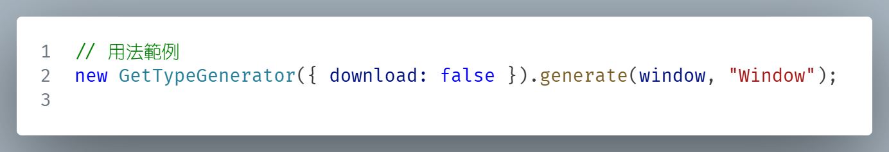

# Js-object-to-ts-interfaces — TypeScript 介面生成器

將任意 JavaScript 物件在「執行時」自動轉換成 TypeScript 介面定義（.d.ts）。



## 為什麼用它？

- 遞迴解析：深度走訪物件並推斷屬性型別
- 循環引用保護：遇到循環時輸出為 `any/* circular */`（可關閉提示）
- 函數型別推斷：從 `toString()` 擷取參數列表，輸出 `(...args) => unknown`
- 事件/策略擴展：以事件處理器模式（handlers）插拔式客製化流程
- 內建特判：自動處理 jQuery（`$`/`jQuery`）與瀏覽器全域物件跳過
- 後處理管線：支援結果字串替換（如清理重複/冗餘片段）
- 一鍵下載：根層呼叫完成時可自動下載 `.d.ts` 檔

## 快速開始

本工具為瀏覽器腳本，最直覺的用法是在任何頁面開啟開發者工具（F12）並於 Console 執行。

1. 將本專案的 `main.js` 內容複製貼到瀏覽器 Console。
2. 執行以下範例：

```ts
// 產生當前網頁環境 Window 型別，並觸發下載 Window.d.ts
const gen = new GetTypeGenerator({ printHint: false, download: true });
gen.generate(window, "Window");

// 針對一般物件（不下載，只回傳字串）
const obj = { id: 1, name: "Alice", tags: ["a", "b"], fn: (x, y) => x + y };
const dts = new GetTypeGenerator({ download: false }).generate(obj, "User");
console.log(dts);
```

從 API 回傳 JSON 生成介面：

```ts
const data = await fetch("/api").then((r) => r.json());
new GetTypeGenerator().generate(data, "ApiResponse"); // 預設會觸發下載
```

> 提示：若你使用 jQuery，建議在型別環境安裝 `@types/jquery`（本專案已列為 devDependency），以便產生 `JQueryStatic` 型別。

## 功能與設計

- 深度遍歷：只遍歷自有屬性（`hasOwnProperty`）
- 函數處理：
  - 原生函數（`[native code]`）輸出為 `"native-code"` 並跳過屬性展開
  - 一般函數：由 `toString()` 擷取 `(...) => unknown`
- 陣列偵測：若鍵名全為數字，會在 `printHint` 模式下附註「可能是 Array」
- jQuery 特判：
  - 於淺層（depth ≤ 1）遇到 `jQuery` 或特徵 `$` 函數時輸出 `JQueryStatic`
- 瀏覽器全域跳過：
  - 內建跳過 `document/location/history/window/...` 等常見全域項
- 後處理替換：
  - 預設清理重複的 jQuery 屬性宣告

## API 參考（精簡版）

```ts
type GetType_obj_type =
  | null
  | number
  | string
  | bigint
  | boolean
  | symbol
  | undefined
  | Function
  | object;

class GetTypeGenerator {
  constructor(c?: { printHint?: boolean; download?: boolean });

  // 產生 TypeScript 介面字串（必要時觸發下載）
  generate(obj: GetType_obj_type, InterfaceName?: string): string;

  // 事件處理器清單（可覆寫/新增）
  get EventHandlerList(): EventHandlerBase<EventHandlerArgType>[];
  set EventHandlerList(list: EventHandlerBase<EventHandlerArgType>[]);
  AddEventHandler(
    h: EventHandlerBase<EventHandlerArgType>
  ): EventHandlerBase<EventHandlerArgType>[];
}

// 事件種類
const enum EventType {
  GetTypeTop = "GetTypeTop",
  GetTypeReturn = "GetTypeReturn",
}

// 處理器回傳值
type EventHandlerReturn =
  | FnActions.Continue
  | FnActions.None
  | [FnActions.Return | FnActions.Eval | FnActions.SetReturn, string];

// 動作枚舉
const enum FnActions {
  Continue,
  Return,
  Eval,
  SetReturn,
  None,
}

// 事件處理器介面（擴展點）
interface EventHandlerBase<EventArg extends EventHandlerArgType> {
  readonly on: EventType;
  do(
    env: {
      obj: GetType_obj_type;
      InterfaceName?: string;
      depth: number;
      path: string[];
    },
    arg: EventArg
  ): EventHandlerReturn;
}
```

### 內建處理器（handlers）

- SkipLoopRef：同一屬性指回根物件時略過（避免立即性自參考）
- JQueryHandler：在淺層自動將 `$`/`jQuery` 轉成 `JQueryStatic`
- SkipProperties：略過一批常見瀏覽器全域鍵或對應之實例
- ReturnHandler：於最終字串階段進行替換清理

### 自訂處理器範例

```ts
// 範例：略過所有以底線開頭的鍵名
class SkipPrivate
  implements EventHandlerBase<{ key: string; element: object[keyof object] }>
{
  on = EventType.GetTypeTop;
  do(env, arg) {
    if (arg.key.startsWith("_")) return FnActions.Continue;
    return FnActions.None;
  }
}

const gen = new GetTypeGenerator({ download: false });
gen.AddEventHandler(new SkipPrivate());
console.log(gen.generate({ _secret: 1, name: "ok" }, "Demo"));
```

## 常見限制與注意事項

- 僅能從函數字串推參數列表，無法推斷回傳型別（一律 `unknown`）
- 原生函數輸出為字串 `"native-code"`，並不展開定義
- 陣列偵測採鍵名全數字的啟發式方式，僅作為提示
- 只枚舉自有屬性（`Object.prototype.hasOwnProperty`）
- jQuery 偵測仰賴特定版本 `toString()` 內容，若不相符可透過自訂 handler 覆寫
- 本工具設計給瀏覽器環境；若在 Node.js 環境使用，需自行模擬 `window/document`
- 內部對 `Eval` 有保護：僅允許 `interfaceStr+=...` 的簡單拼接，請勿傳入不受信任的程式碼

## 開發與建置

專案以 TypeScript 撰寫，倉庫已包含編譯出的 `main.js`。若需自行編譯：

```powershell
# （可選）安裝相依
pnpm i

# 使用 npx 編譯（需本機安裝 Node.js）
npx tsc -p tsconfig.json
```

編譯成功後，瀏覽器端直接以 `<script src="./main.js"></script>` 載入即可。

## 貢獻

歡迎提出 Issue 或 PR。若要提交策略／處理器，請附上最小可重現範例與預期輸出。
