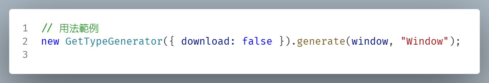

# js-object-to-ts-interfaces

將任意 JavaScript 物件於「執行時」自動轉換為 TypeScript 介面（.d.ts），支援事件擴展、全域/框架掛載搜尋與一鍵下載。



---

## Technology Stack

- **TypeScript** ^5.6.3
- **JavaScript**（瀏覽器端）
- **pnpm**（monorepo 套件管理）
- **esbuild**（IIFE bundle 打包）
- **rimraf**（清理工具）
- **@types/jquery**（型別支援）

---

## Project Architecture

- **事件驅動架構**：以 EventHandler pipeline 為核心，所有型別推斷與擴展都透過 handler 插拔實現。
- **遞迴遍歷與循環保護**：遞迴走訪物件屬性，WeakSet 防止循環引用。
- **Monorepo 結構**：
  - Root：主型別生成邏輯（main.ts）
  - @js-to-ts-interfaces/core：共用工具（isNativeFunction、isNumericKey、iframe、diffGlobalKeys）
  - @js-to-ts-interfaces/search-key：注入 `$searchKey()`，支援全域/Vue/React 掛載搜尋
- **IIFE 輸出**：所有模組最終以 IIFE 形式 bundle，方便 `<script>` 直接載入

---

## Getting Started

### 安裝與建置

```powershell
pnpm i
pnpm build           # 建置所有套件與主程式
# 或分別建置
pnpm build:core      # 只建 core
pnpm build:searchKey # 只建 searchKey
pnpm run build:root  # 只建 root
```

### 使用方式

1. 將 `main.js` 複製貼到瀏覽器 Console。
2. 產生介面範例：
   ```ts
   const gen = new GetTypeGenerator({ printHint: false, download: true });
   gen.generate(window, "Window"); // 下載 Window.d.ts
   ```
3. 針對一般物件：
   ```ts
   const obj = { id: 1, name: "Alice", tags: ["a", "b"], fn: (x, y) => x + y };
   const dts = new GetTypeGenerator({ download: false }).generate(obj, "User");
   console.log(dts);
   ```
4. 從 API 回傳 JSON 生成介面：
   ```ts
   const data = await fetch("/api").then((r) => r.json());
   new GetTypeGenerator().generate(data, "ApiResponse");
   ```
5. 注入 `$searchKey` 並搜尋全域/框架掛載點：
   ```ts
   await injectSearchKey();
   const results = window.$searchKey!("store", true);
   if (results.length) {
     const targetObj = results[0].code;
     const dts = new GetTypeGenerator({ download: false }).generate(
       targetObj,
       "Store",
     );
     console.log(dts);
   }
   ```

---

## Project Structure

```
.
├── main.ts                # 主型別生成邏輯
├── eventHandlers.ts       # 事件處理器擴展點與內建策略
├── packages/
│   ├── core/              # 共用核心工具
│   │   └── main.ts
│   └── searchKey/         # $searchKey 注入與全域/框架掛載搜尋
│       └── main.ts
├── package.json           # 根專案設定
├── pnpm-workspace.yaml    # monorepo 套件管理
├── tsconfig.base.json     # TypeScript 共用設定
└── ...
```

---

## Key Features

- 遞迴型別推斷：自動深度走訪物件，推斷所有屬性型別
- 循環引用保護：遇到循環時自動輸出 `any/* circular */`
- 函數型別推斷：從 `toString()` 擷取參數，產生 `(...args) => unknown`
- 事件/策略擴展：以 handler pipeline 插拔式自訂型別推斷流程
- jQuery/全域特判：自動處理 `$`/`jQuery` 及常見瀏覽器全域物件跳過
- 後處理管線：支援結果字串替換（如清理重複/冗餘片段）
- 一鍵下載：根層呼叫時自動下載 `.d.ts` 檔
- $searchKey 工具：可搜尋全域/Vue/React 掛載點後再生成介面，支援 fuzzy 搜尋
- 自訂事件處理器：可擴充/覆寫事件處理器，實現自定義跳過、型別轉換等策略
- IIFE 輸出：所有 bundle 可直接 `<script>` 載入瀏覽器

---

## Development Workflow

- `pnpm build`：遞迴建置所有套件與主程式
- `pnpm build:core`、`pnpm build:searchKey`、`pnpm run build:root`：分別建置各子套件或 root
- 修改 TypeScript 檔案後需重新 build
- 測試可於瀏覽器 Console 載入 main.js
- 事件處理器可自訂並以 `AddEventHandler()` 註冊，執行順序依註冊順序
- 主要分支為 `main`，開發分支如 `dev`，PR 合併

---

## Coding Standards

- TypeScript/ESNext，嚴格型別檢查
- 命名慣例：
  - 常數：`SCREAMING_SNAKE_CASE`
  - 型別：`PascalCase`
  - 私有方法：`private` 關鍵字
- import 僅用 path alias（`@js-to-ts-interfaces/core`），禁止跨 package 相對路徑
- 只針對複雜邏輯、API、特殊正則等加註解，避免冗餘
- 事件處理器 pipeline，僅遍歷自有屬性

---

## Testing

- 主要於瀏覽器 Console 載入 `main.js`，針對各種物件、API 回傳、全域變數等進行型別生成測試
- 測試流程：
  1. 複製 `main.js` 至瀏覽器 Console
  2. 執行各種 `generate()` 測試案例
- 可撰寫自訂 handler 測試型別生成流程
- `pnpm build` 後確認 bundle 可於瀏覽器正常執行
- （目前以手動驗證為主，未見自動化單元測試腳本）

---

## Contributing

- 歡迎提出 Issue 或 PR，建議附上最小可重現範例與預期輸出
- 自訂策略/事件處理器請以 `EventHandlerBase` 介面實作，並用 `AddEventHandler()` 註冊
  - 範例：
    ```ts
    class SkipPrivate
      implements EventHandlerBase<{ key: string; element: any }>
    {
      on = EventType.GetTypeTop;
      do(env, arg) {
        if (arg.key.startsWith("_")) return FnActions.Continue;
        return FnActions.None;
      }
    }
    const gen = new GetTypeGenerator({ download: false });
    gen.AddEventHandler(new SkipPrivate());
    ```
- PR 請說明設計動機與使用情境，bugfix 請附重現步驟
- 未來規劃：遞迴走訪與鍵蒐集將抽離至 core，降低重複維護

- 深度遍歷：只遍歷自有屬性（`hasOwnProperty`）
- 函數處理：
  - 原生函數（`[native code]`）輸出為 `null` 並跳過屬性展開
  - 一般函數：由 `toString()` 擷取 `(...) => unknown`
- 陣列偵測：若鍵名全為數字，會在 `printHint` 模式下附註「可能是 Array」
- jQuery 特判：
  - 於淺層（depth ≤ 1）遇到 `jQuery` 或特徵 `$` 函數時輸出 `JQueryStatic`
- 瀏覽器全域跳過：
  - 內建跳過 `document/location/history/window/...` 等常見全域項
- 後處理替換：
  - 預設清理重複的 jQuery 屬性宣告

## API 參考（精簡版）

```ts
type GetType_obj_type =
  | null
  | number
  | string
  | bigint
  | boolean
  | symbol
  | undefined
  | Function
  | object;

class GetTypeGenerator {
  constructor(c?: { printHint?: boolean; download?: boolean });

  // 產生 TypeScript 介面字串（必要時觸發下載）
  generate(obj: GetType_obj_type, InterfaceName?: string): string;

  // 事件處理器清單（可覆寫/新增）
  get EventHandlerList(): EventHandlerBase<EventHandlerArgType>[];
  set EventHandlerList(list: EventHandlerBase<EventHandlerArgType>[]);
  AddEventHandler(
    h: EventHandlerBase<EventHandlerArgType>,
  ): EventHandlerBase<EventHandlerArgType>[];
}

// 事件種類
const enum EventType {
  GetTypeTop = "GetTypeTop",
  GetTypeReturn = "GetTypeReturn",
}

// 處理器回傳值
type EventHandlerReturn =
  | FnActions.Continue
  | FnActions.None
  | [FnActions.Return | FnActions.Eval | FnActions.SetReturn, string];

// 動作枚舉
const enum FnActions {
  Continue,
  Return,
  Eval,
  SetReturn,
  None,
}

// 事件處理器介面（擴展點）
interface EventHandlerBase<EventArg extends EventHandlerArgType> {
  readonly on: EventType;
  do(
    env: {
      obj: GetType_obj_type;
      InterfaceName?: string;
      depth: number;
      path: string[];
    },
    arg: EventArg,
  ): EventHandlerReturn;
}
```

### 內建處理器（handlers）

- SkipLoopRef：同一屬性指回根物件時略過（避免立即性自參考）
- JQueryHandler：在淺層自動將 `$`/`jQuery` 轉成 `JQueryStatic`
- SkipProperties：略過一批常見瀏覽器全域鍵或對應之實例
- ReturnHandler：於最終字串階段進行替換清理

### 自訂處理器範例

```ts
// 範例：略過所有以底線開頭的鍵名
class SkipPrivate
  implements EventHandlerBase<{ key: string; element: object[keyof object] }>
{
  on = EventType.GetTypeTop;
  do(env, arg) {
    if (arg.key.startsWith("_")) return FnActions.Continue;
    return FnActions.None;
  }
}

const gen = new GetTypeGenerator({ download: false });
gen.AddEventHandler(new SkipPrivate());
console.log(gen.generate({ _secret: 1, name: "ok" }, "Demo"));
```

## 常見限制與注意事項

- 僅能從函數字串推參數列表，無法推斷回傳型別（一律 `unknown`）
- 原生函數輸出為字串 `"native-code"`，並不展開定義
- 陣列偵測採鍵名全數字的啟發式方式，僅作為提示
- 只枚舉自有屬性（`Object.prototype.hasOwnProperty`）
- jQuery 偵測仰賴特定版本 `toString()` 內容，若不相符可透過自訂 handler 覆寫
- 本工具設計給瀏覽器環境；若在 Node.js 環境使用，需自行模擬 `window/document`
- 內部對 `Eval` 有保護：僅允許 `interfaceStr+=...` 的簡單拼接，請勿傳入不受信任的程式碼

## 開發與建置

專案以 TypeScript 撰寫，倉庫已包含編譯出的 `main.js`。若需自行編譯：

```powershell
# （可選）安裝相依
pnpm i

# 使用 npx 編譯（需本機安裝 Node.js）
npx tsc -p tsconfig.json
```

多套件（monorepo）建置：

```powershell
pnpm build           # 遞迴編譯 core / search-key / root
pnpm build:core      # 只編譯共用核心工具
pnpm build:searchKey # 只編譯搜尋鍵工具
```

編譯成功後，瀏覽器端直接以 `<script src="./main.js"></script>` 載入即可。

## 貢獻

歡迎提出 Issue 或 PR。若要提交策略／處理器，請附上最小可重現範例與預期輸出。

若要增强 `$searchKey` 與介面生成整合（例如直接選路徑自動生成介面），歡迎提出新功能需求。未來規劃將把遞迴走訪與鍵蒐集的共通程式抽離到 `@js-to-ts-interfaces/core` 中，降低重複維護成本。
